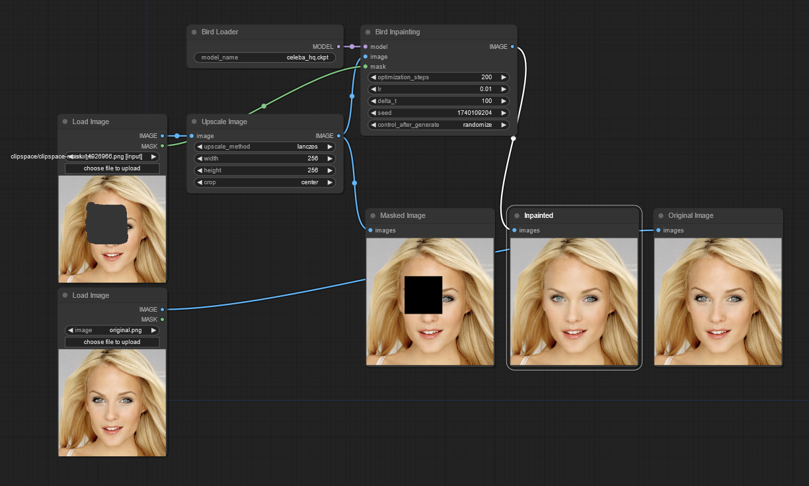
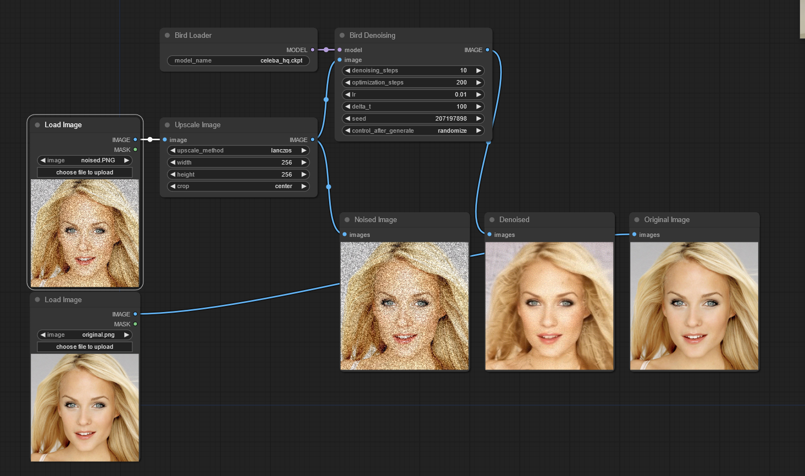
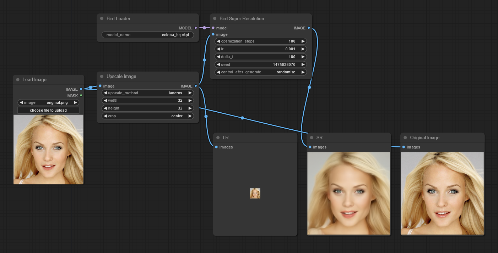

# ComfyUI-NuA-BIRD
ComfyUI implementation of ["Blind Image Restoration via Fast Diffusion Inversion"](https://github.com/hamadichihaoui/BIRD)</br>
Original [article](https://arxiv.org/abs/2405.19572)

## Features
1. Blind Deblurring
2. Non-uniform Deblurring
3. Inpainting
4. Denoising
5. Superresolution

## Installation
1. Clone the repository into the `ComfyUI/custom_nodes` directory

    ```sh
    cd ComfyUI/custom_nodes
    git clone https://github.com/nuanarchy/ComfyUI-NuA-BIRD.git
    ```

2. Install the required modules

    ```sh
    pip install -r ComfyUI-NuA-BIRD/requirements.txt
    ```

3. Copy the [model weights](https://drive.google.com/file/d/1qMs7tNGV3tkOZNKH5L130dkwsmobEJdh/view?usp=sharing) into the appropriate folder
   `ComfyUI/models/checkpoints`

## Examples
In the `examples` folder, you will find the workflow diagrams, the JSON file with the configurations, and resulting images.

## Workflow Diagrams
### Blind Deblurring


### Non-uniform Deblurring


### Inpainting



### Denoising



### Super Resolution



### Important
The results primarily depend on the pretrained model and the dataset</br>
Limitations:
1. The model only works with square images at a resolution of 256x256 pixels
2. Faces must be cropped and centered in the images
3. For Super Resolution tasks, the input image resolution can be any size smaller than 256x256 pixels

If you want to overcome these limitations, you can train your own diffusion model using custom datasets.</br>
You can use the OpenAI repository: [improved-diffusion](https://github.com/openai/improved-diffusion.git)
